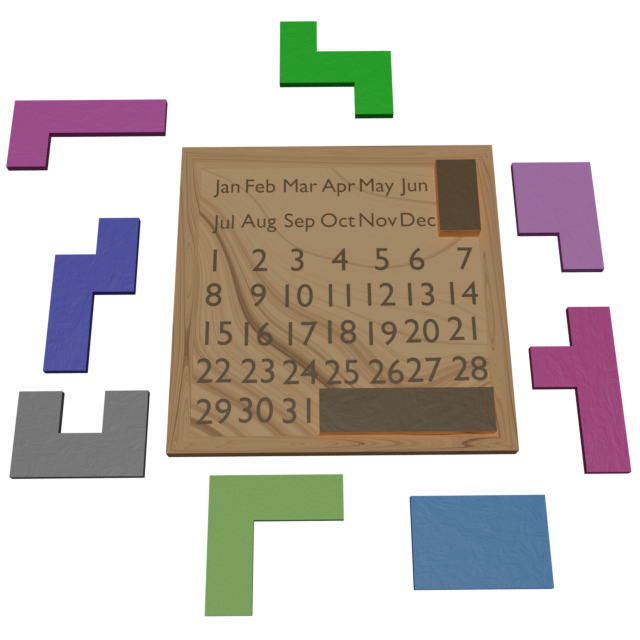
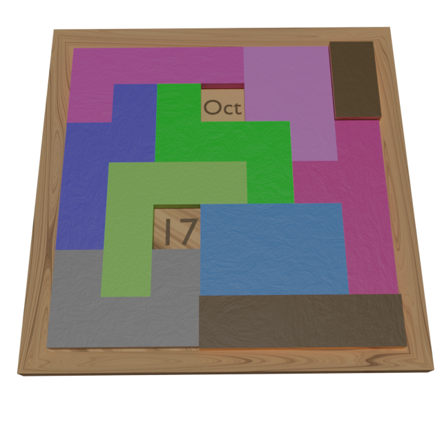
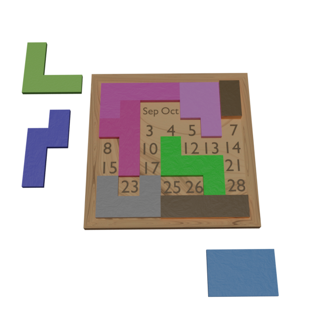
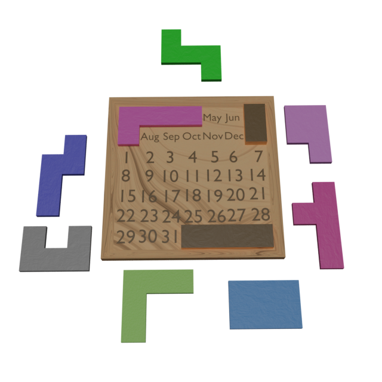
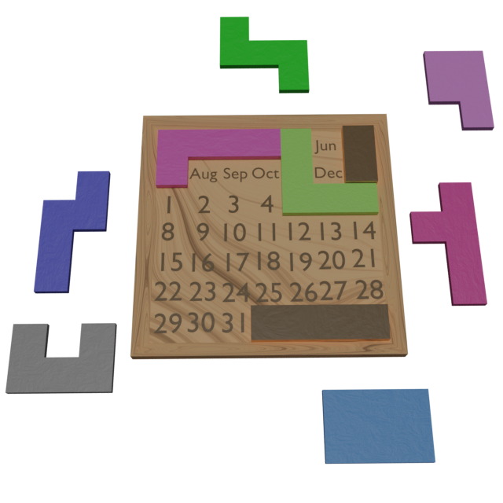
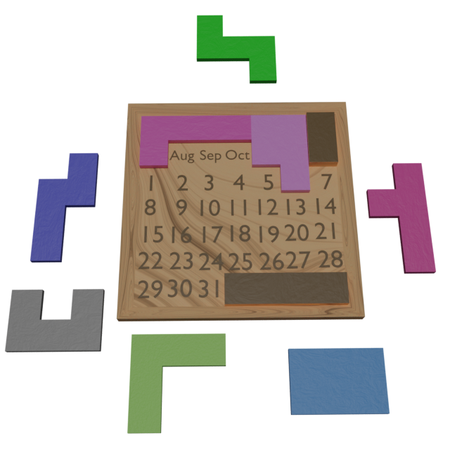

Title: Resolver el Puzzle-A-Day para niños
Date: 2023-10-29
Category: Resolución de problemas en C++
Tags: C++, Optimización
Summary: ¿Qué mejor manera de resolver un juego de niños que usar backtracking?

# 0. El puzzle

Hace un tiempo, un compañero de trabajo me habló de un puzzle para niños que resultaba difícil de resolver. 
Consta de un tablero con los meses del año y los días del mes dibujados y 8 piezas de diferentes formas. 
Estas piezas pueden encajar sobre el tablero de manera que quedan dos huecos libres.

El objetivo es colocar todas las piezas sobre el tablero de manera que los dos huecos libres queden sobre el mes y el día de la fecha actual.
Su nombre es Puzzle-A-Day y se puede jugar una versión online [aquí](https://mathigon.org/polypad/A62G5zIdDPthg).

Por ejemplo, si hoy fuera 17 de octubre, las piezas deberián colocarse de la siguiente manera:

# 1. Resolución

En un principio, el problema parece complejo. 
Hay 8 piezas, cada una se puede colocar de ocho maneras distintas en más de 20 posiciones del tablero.

Sin embargo, cada vez que se coloca una pieza, las opciones para la siguiente se reducen drásticamente.
Por ejemplo, si estamos probando la siguiente colocación de piezas:

Se observa que ya no hay hueco para el rectángulo azul, por lo que tendremos que cambiar de posición alguna de las piezas que ya hemos colocado.

Por lo tanto, un posible proceso para resolver este problema sería ir colocando las piezas una a una de manera sistemática y, 
si observamos que no vamos a llegar a una solución, dar marcha atrás y modificar la colocación anterior.
Este algoritmo es conocido como [backtracking](https://en.wikipedia.org/wiki/Backtracking).
En la práctica, es equivalente a probar todas las posibles combinaciones de piezas hasta encontrar la solución aunque de forma más eficiente.

En nuestro caso, vamos a seguir los siguientes pasos:

1. Localizar la siguiente casilla que queremos cubrir con una pieza.
2. Buscar una pieza que cubra esa casilla.
3. Si la encontramos, la colocamos y volvemos al paso 1.
4. Si no la encontramos, hacemos una modificación a la última pieza que hemos colocado y volvemos al paso 2.
   Si no existen más opciones para el paso anterior, modificamos la pieza de dos pasos atrás y volvemos al paso 2.

Por ejemplo, para cubrir el 17 de octubre.

1. La primera casilla que queremos cubrir es la que dice 'Jan'.
2. Encontramos una pieza que puede cubrir esa casilla:
   
3. La siguiente casilla a cubrir es la que dice 'May'
4. Encontramos una pieza que puede cubrir esa casilla:
   
5. La siguiente casilla a cubrir es la que dice 'Jun'. 
   Sin embargo, no hay ninguna pieza que pueda cubrirla.
   Por lo tanto, quitamos la pieza anterior y ponemos otra:
   
6. La siguiente casilla a cubrir es la que dice 'Aug'.
7. Continuamos probando hasta dar con la solución.

# 3. Implementación en C++

En el repositorio de [PuzzleADay](https://github.com/jcallejap/PuzzleADaySolver) hay una implementación del algoritmo de backtracking para resolver el problema.
